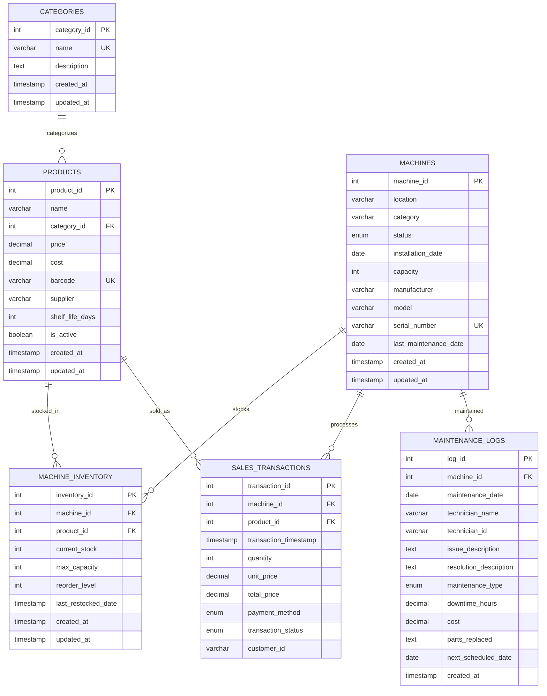

# Entity-Relationship Diagram (ERD)

## Relationship Explanations

### 1:Many Relationships

1. **CATEGORIES → PRODUCTS** (1:Many)
   - One category can contain multiple products
   - Each product belongs to exactly one category
   - Enforced by foreign key: `products.category_id → categories.category_id`

2. **MACHINES → SALES_TRANSACTIONS** (1:Many)
   - One machine can process multiple sales transactions
   - Each transaction is processed by exactly one machine
   - Enforced by foreign key: `sales_transactions.machine_id → machines.machine_id`

3. **PRODUCTS → SALES_TRANSACTIONS** (1:Many)
   - One product can appear in multiple sales transactions
   - Each transaction line item is for exactly one product
   - Enforced by foreign key: `sales_transactions.product_id → products.product_id`

4. **MACHINES → MAINTENANCE_LOGS** (1:Many)
   - One machine can have multiple maintenance records
   - Each maintenance record is for exactly one machine
   - Enforced by foreign key: `maintenance_logs.machine_id → machines.machine_id`

### Many:Many Relationship

**MACHINES ↔ PRODUCTS** (Many:Many through MACHINE_INVENTORY)
- One machine can stock multiple different products
- One product can be stocked in multiple machines
- Resolved through junction table: `machine_inventory`
- Composite unique key: `(machine_id, product_id)` ensures no duplicates

## Key Constraints and Business Rules

### Primary Keys
- All tables have auto-incrementing integer primary keys
- Ensures unique identification of each record

### Foreign Keys
- Maintain referential integrity between related tables
- Cascade updates where appropriate
- Restrict deletions to prevent data orphaning

### Unique Constraints
- `categories.name` - Category names must be unique
- `machines.serial_number` - Machine serial numbers must be unique
- `products.barcode` - Product barcodes must be unique
- `machine_inventory.(machine_id, product_id)` - One record per product per machine

### Check Constraints
- `machines.capacity > 0 AND capacity <= 1000` - Reasonable capacity limits
- `products.price > cost AND price > 0` - Ensures profitability
- `machine_inventory.current_stock <= max_capacity` - Prevents overstocking
- `sales_transactions.total_price = unit_price * quantity` - Calculation integrity

### Enumerated Values
- `machines.status`: ACTIVE, INACTIVE, MAINTENANCE, OUT_OF_ORDER
- `sales_transactions.payment_method`: CASH, CARD, MOBILE, CONTACTLESS
- `sales_transactions.transaction_status`: COMPLETED, FAILED, REFUNDED
- `maintenance_logs.maintenance_type`: PREVENTIVE, CORRECTIVE, EMERGENCY, UPGRADE

## Normalization Level

The database is designed to **3rd Normal Form (3NF)**:

1. **1NF**: All attributes contain atomic values
2. **2NF**: No partial dependencies on composite keys
3. **3NF**: No transitive dependencies

### Examples of Normalization:
- Product categories are normalized into separate `categories` table
- Machine and product information stored separately from inventory
- Transaction details separated from machine and product master data
- Maintenance information separated from machine master data

This design minimizes data redundancy while maintaining query performance through appropriate indexing.
